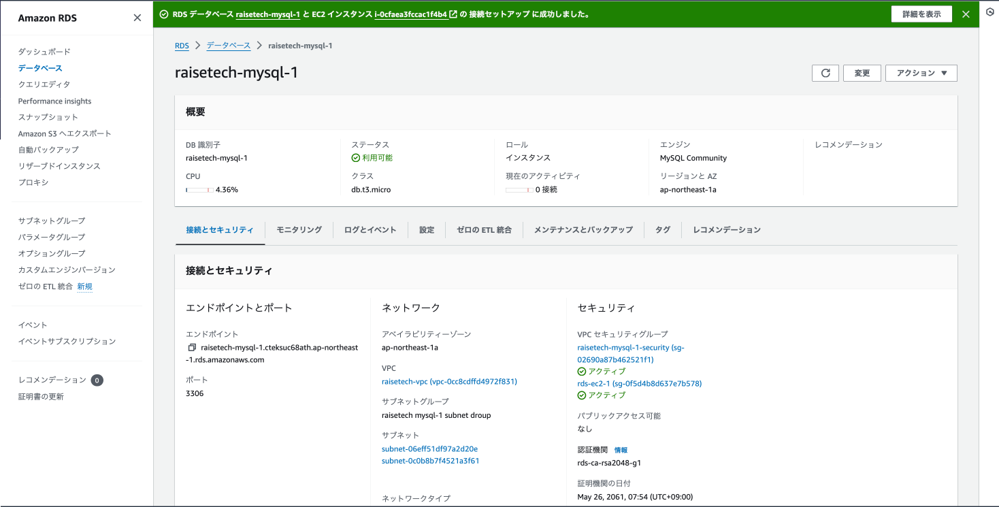

## 第４回課題

### 1.新規作成したVPC

### 2.EC2について

  1.EC2の詳細
  

  2.EC2のインバウンドルール
 
 ローカルPCからの接続を許可と、EC2 Instance Connectを利用した接続の許可
  

### 3.RDSについて

  1.RDSの詳細
  

  2.RDSのインバウンドルール

   EC2インスタンスのみ接続を許可

### 4.ローカルPC上でEC2からRDSへの接続の確認

### 5.学習した内容の感想

  - 今回の課題から本格的な構築に入るとのことで、講義で先生が仰っていた通り、コンピューター、ネットワーク周りの知識がなかった自分にはかなりハードルが高く感じた。
  - 補足教材や参考にしたWEBサイト、AWS公式ドキュメントで足りない知識を埋めていくのが大変だったが、色々学習したおかげで、VPC内での構築イメージを頭の中でも描きやすくなったように思う。
  - セキュリティグループでパラメーター設定がうまく出来ず、とても苦労したが、 エラー内容を自分なりに考え対応し、EC2にSSH接続、EC2 Instance Connectを使用しての接続ができたときは達成感があった。
  - エラーが出た際にいつも混乱してしまうので、自分の持っている知識での対処の可否、何の作業をしているか今の状態を明確にする、対処の方法を順序立てて考える等基本的な課題(仕事)への取り組み方を見直そうと思った。
