# 第5回課題 

## EC2にサンプルアプリケーションのデプロイ

 1. pumaでの動作確認

- systemdで起動
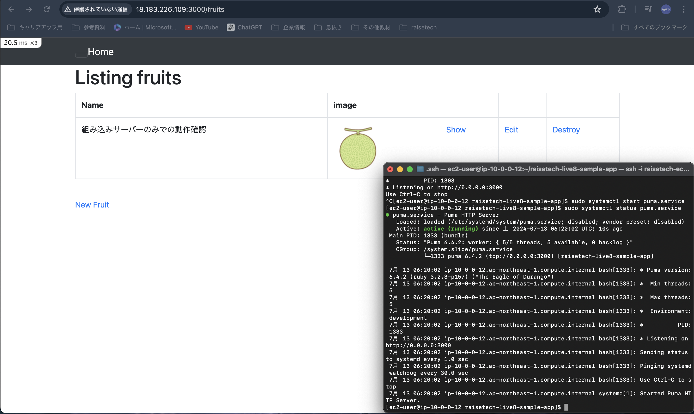

 2. Unixsocketを利用したpumaでの動作確認

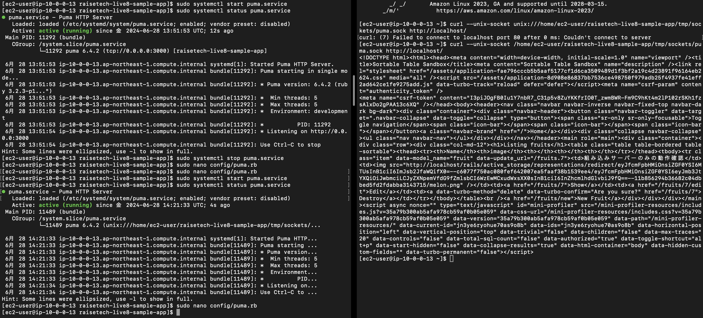

 3. Nginx単体での動作確認

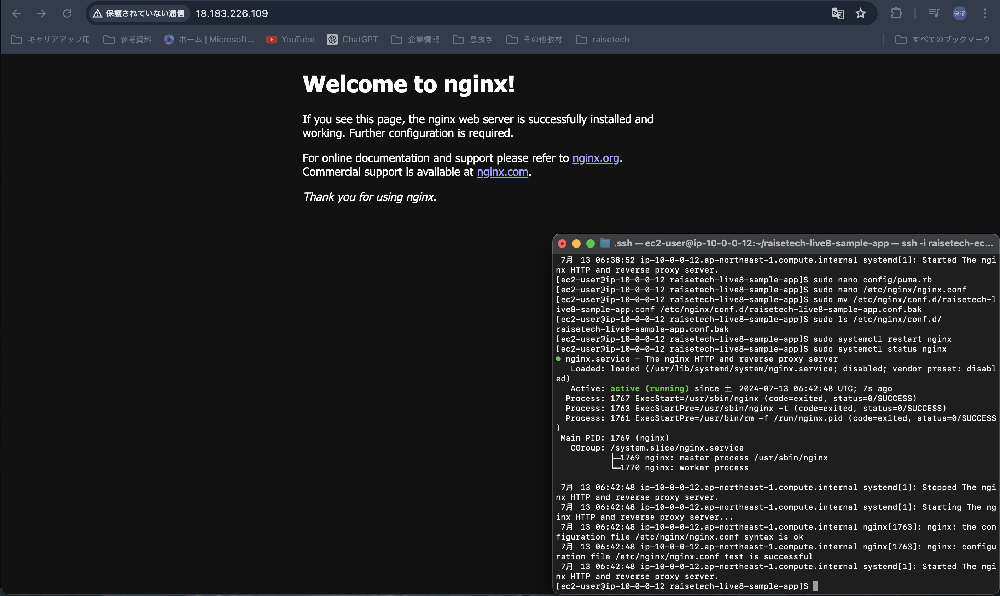

 4. pumaとNginxをUnixsocketを利用した環境での動作確認

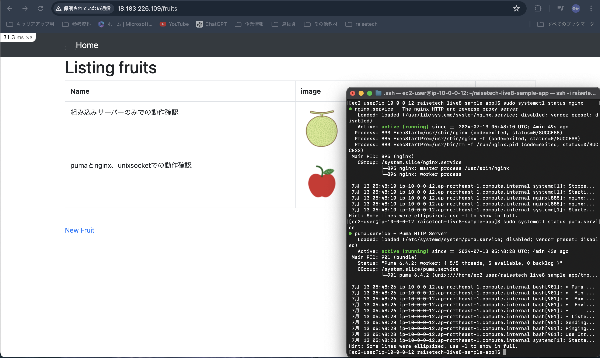

## ELB経由でEC2への接続確認

 1. ALBの作成

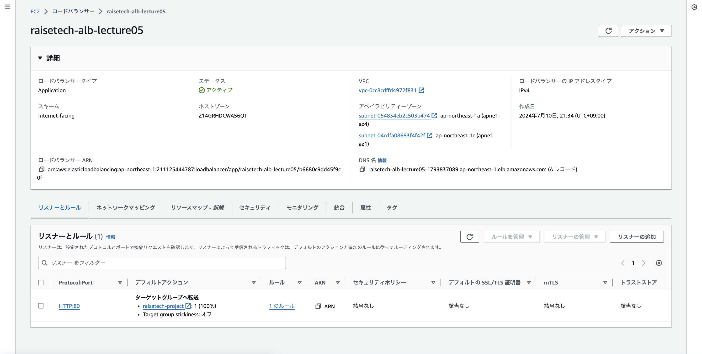

 2. ターゲットグループのヘルスステータスを確認

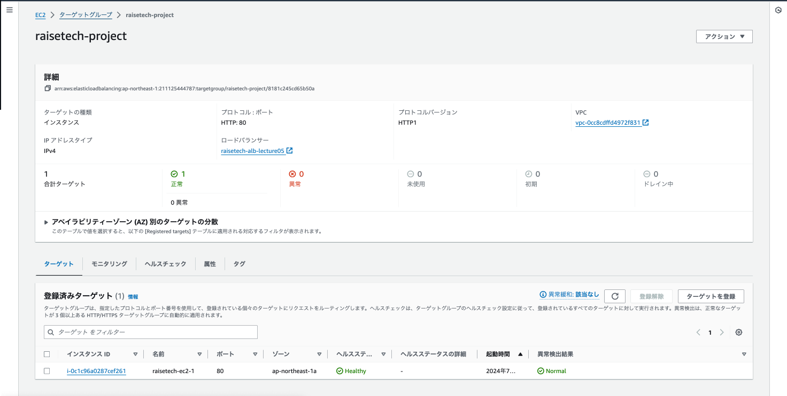

 3. ALBのDNS名での動作確認

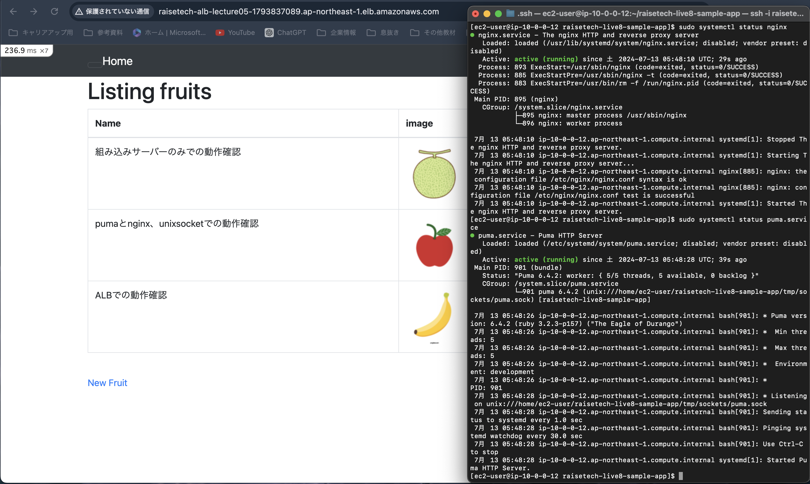

## S3を画像データ保存先に利用しての動作確認

1. S3の作成

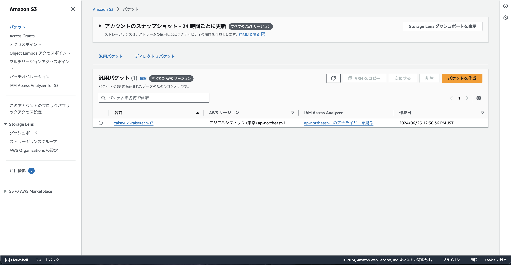

2. EC2にアタッチするIAMロールの作成

- AmazonS3FullAcces権限を付与
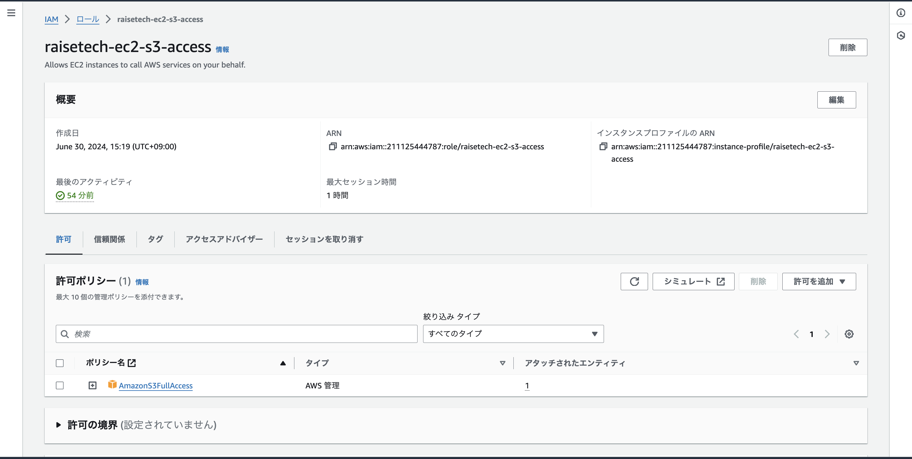

3. IAMロールをEC2にアタッチ

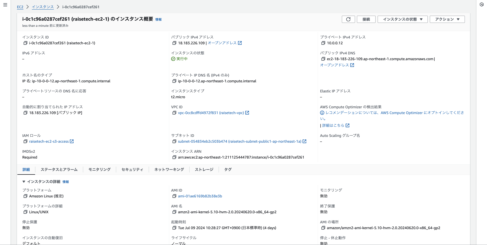

4. S3に画像が保存されているかの動作確認

- ブラウザでの確認
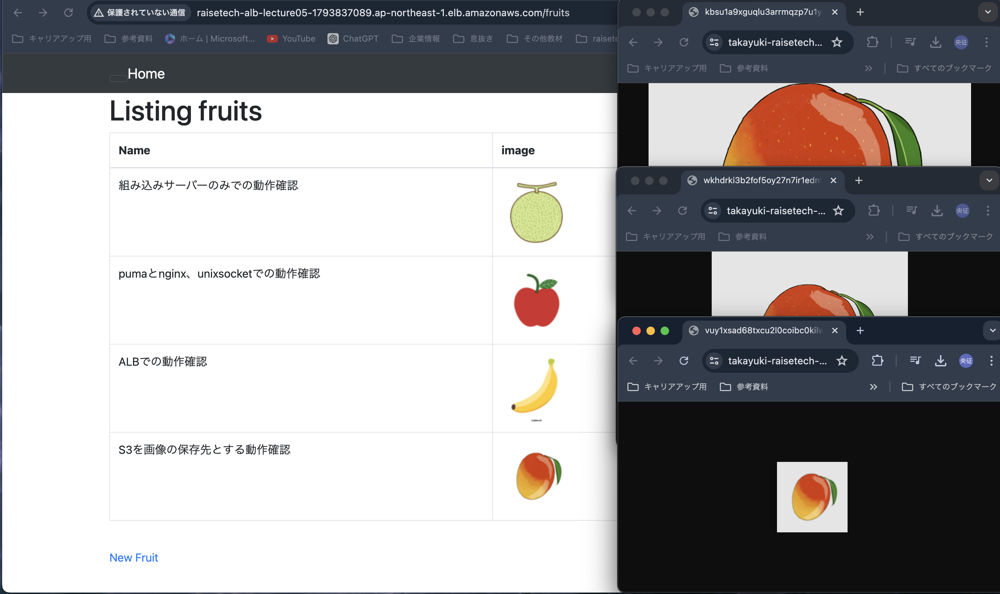

- AWSコンソール画面での確認
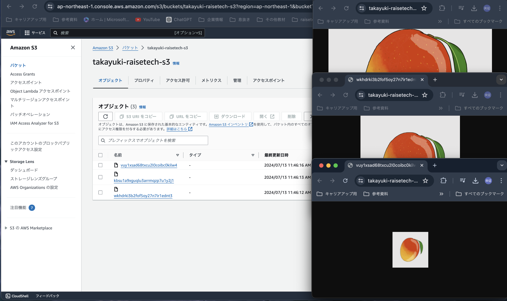

## 構築した環境の構成図の作成

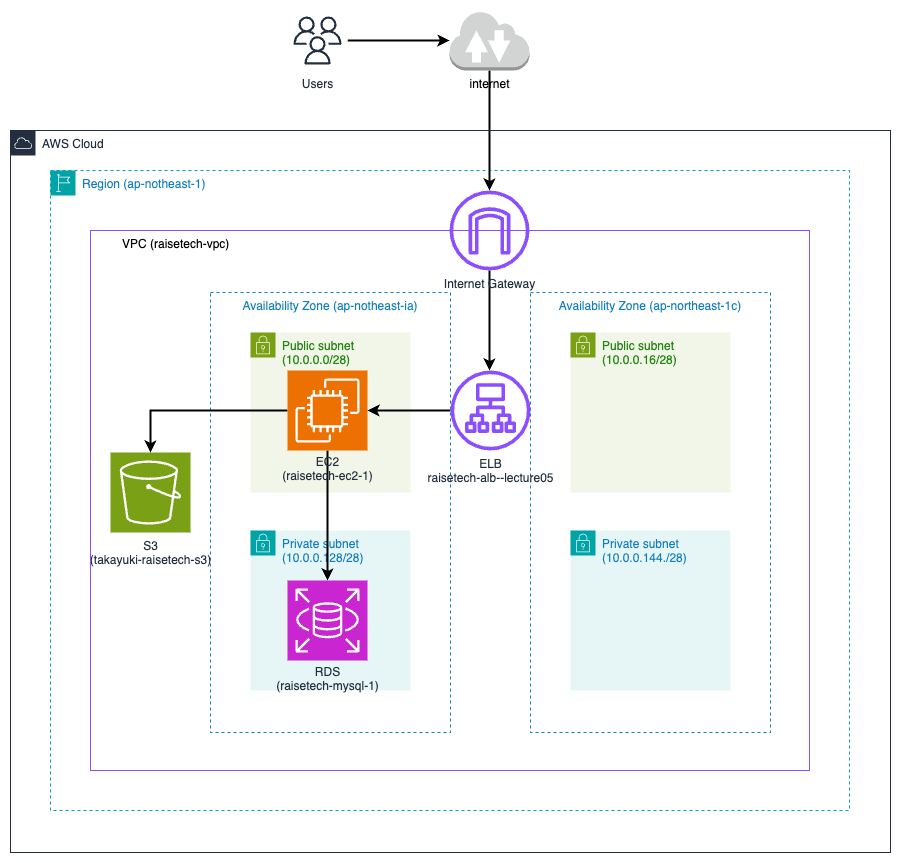

## 構築した環境の構成図の作成(修正版)

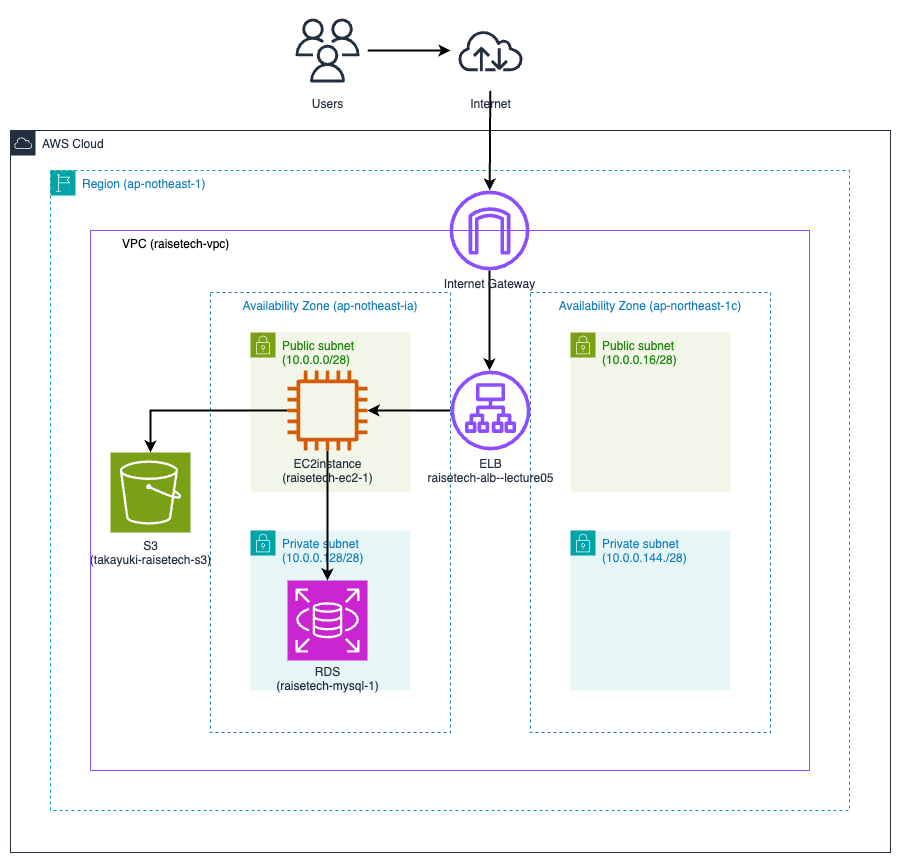

## 今回の学習の感想
- 今回の環境構築にあたり、色々なファイルの設定内容の意味やどう関連しているのかの理解がとても難しかったです。
- エラーや問題にあたるたびに色々なブログ記事や公式ドキュメントを参考にしましたが、そもそもの知識量が乏しく記述内容を読み解く力がもっと必要だと感じました。
- 今回の課題で詰まった部分は、RDSへの接続、ブラウザで保存した画像が表示されない、画像が保存できないなど色々ありましたが、沢山のエラーや問題に対応したおかげで多少なりとも自信がついたように思います。