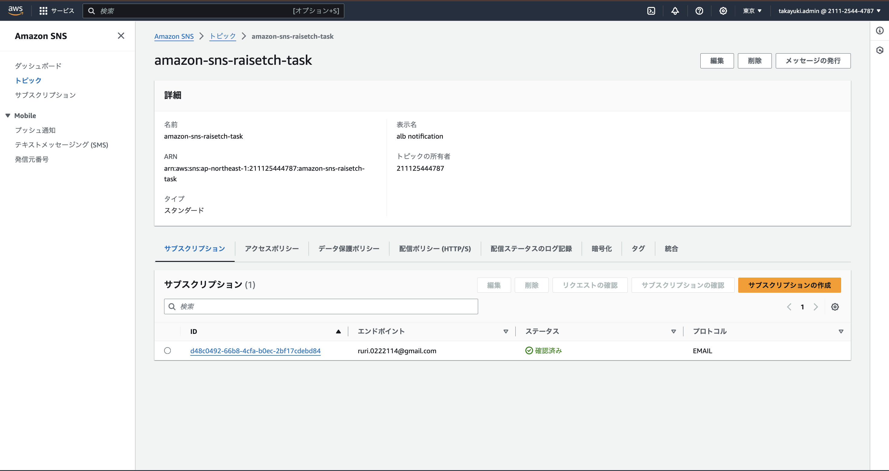
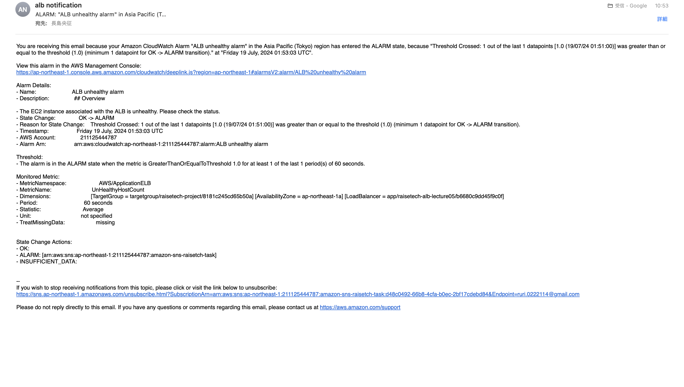

# 第6回課題

## AWSを利用した日の記録を、CloudTrailのイベントから探し出す

1. イベント名:StopDBInstance

2. 含まれている内容を３つピックアップ
- eventrime:2024-07-16115:38:092
- eventsource:rds.amazonaws.com
- eventName:stopDBInstance

## CloudWatchアラームを使いALBのアラームを設定し、メール通知を確認

1. Amazon SNS トピックを作成

2. Cloud Watch Alarm を作成

## アラームとアクションを設定した状態で、Railsアプリケーションを使用可、不可の状態にしての動作確認

1. Railsアプリケーションが使用可の状態の時

- AWSコンソール画面(OK) 

- 届いたメール

2. ailsアプリケーションが使用不可の状態の時

- AWSコンソール画面(アラーム状態) 

- 届いたメール

## AWS利用料の見積を作成

1. 今日までに作成したリソースの内容を見積り(URLで共有)

- 見積もりは[こちらから](https://calculator.aws/#/estimate?id=397c945b3fe76d6e4c1283b8c8bca4f9952448f3)

## EC2の料金がいくらかを、先月の請求情報から確認

1. 先月の請求の概要

2. サービス別料金からEC2が無料利用枠内であることを確認(Free Tierの表記確認)

##　今回の学習の感想

 - ログを取る、見ることが、重要なのは第五回課題中でも学びましたが、今回の課題においてもその重要性を改めて再認識することができました。
 - コスト管理についても、AWSは有料サービスだということを念頭に置き、現在かかっているコストの把握、将来かかるコストを常に意識できるようにしていきたいと感じました。
 