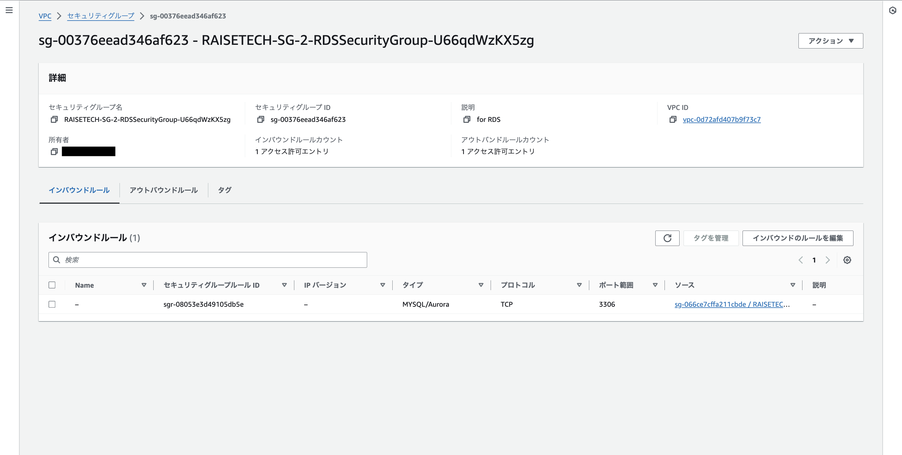
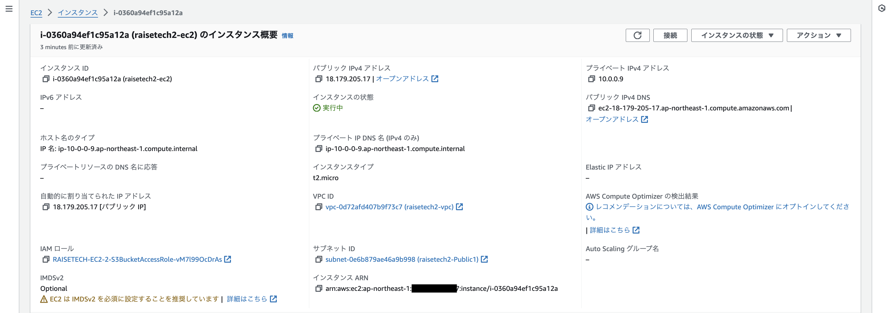
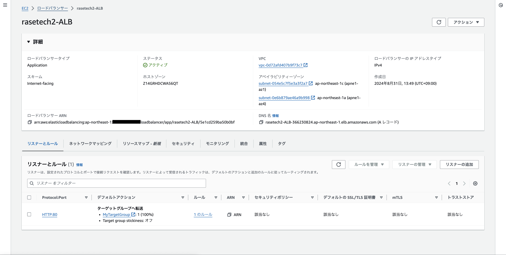
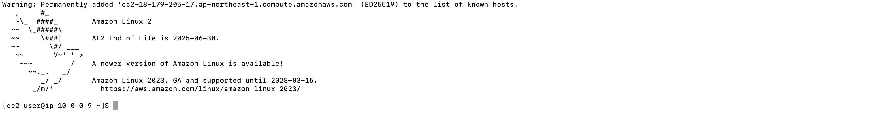

# 第10回課題

## 構成
* 第五回課題で作成した構成図の環境になるよう構築を進めた。
* 下の図のスタック単位でYMLファイルを作成した。

| スタック名 | テンプレートのリンク先 | リソース | 備考など |
|:----------------:|:----------------:|:----------------:|:----------------:|
|RAISETECH-VPC-2|[CF_NETWORK.yml](lecture10_yml/CF_NETWORK.yml)|VPC IGW PublicSubnet PrivateSubnet RouteTable |VPCのID Public2つとPrivate2つのID PubricSubnet内のリソースをインターネット接続可にする|
|RAISETECH-SG-2|[CF_SG.yml](lecture10_yml/CF_SG.yml)|ALBSecurityGroup EC2SecurityGroup RDSSecurityGroup| 各リソース用のSecurityGroup|
|RAISETECH-EC2-2|[CF_EC2.yml](lecture10_yml/CF_EC2.yml)|EC2Instance EC2InstanceProfile S3BucketAccessRole|EC2インスタンスのID キーペアは事前にマネジメントコンソールで作成したものを使用|
|RAISETECH-RDS-2|[CF_RDS.yml](lecture10_yml/CF_RDS.yml)|RDSInstance RDSSecret RDSSubnetGroup|MYSQLでDB作成|
|RAISETECH-ELB-2|[CF_ELB.yml](lecture10_yml/CF_ELB.yml)|LoadBalancer HTTPListener TargetGroup|EC2インスタンスとの紐付け|
|RAISETECH-S3-2|[CF_S3.yml](lecture10_yml/CF_S3.yml)|S3Bucket|フルアクセスを許可|

## 作成したスタックの一覧

## 構築したVPCの環境確認

## 構築したSecurityGroupの環境確認

* EC2インバウンドルール

* EC2アウトバウンドルール

* RDSインバウンドルール

* RDSアウトバウンドルール

* ALBインバウンドルール

* ALBアウトバウンドルール

## 構築したEC2の環境確認

* EC2の概要

* EC2の詳細

* IAMrole

## 構築したRDSの環境確認

## 構築したELBの環境確認

* ALB

* ターゲットグループ

* ヘルスチェック

## 構築したS3の環境確認

## EC2へのSSH接続確認

## EC2からRDSへの接続確認

## 感想
* スタックの分割をどの基準でするか悩みましたが、今回は各テンプレートでの記述内容を理解することを目的としていたため、主要なリソース毎にわけてスタックを作成しました。
* 構築の仕方は実際の現場などでケースバイケースだと思うので、今後CloudFormationで構築する際は、その時の最適解を考えて利用していきたいと思いました。
* スタック作成時にインデントなどyamlファイルの構成が間違っていることでエラーが出てそれを解消することが多く苦労しました。
* これまでの課題で構築した環境を改めてCloudFormationで自動構築することで、各サービスやリソースの紐付けに関しての理解が深まりました。
* テンプレート作成の際、様々な公式ドキュメントや技術ブログに触れましたが、多種多様な方法があり、取り入れたい記述方法や機能を探す・決めることが難しく感じました。
